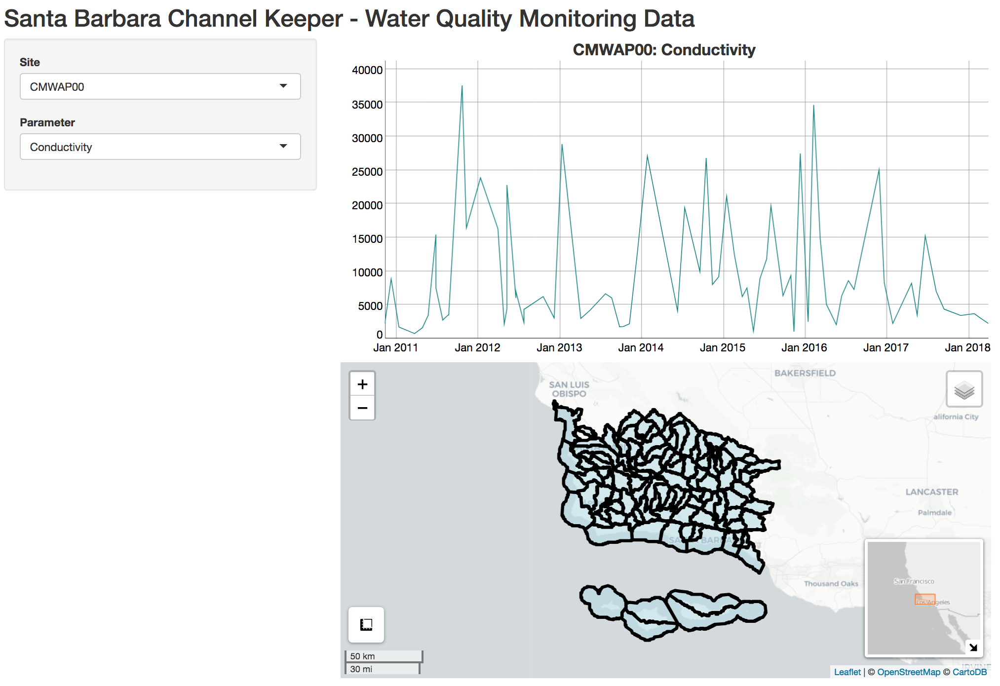
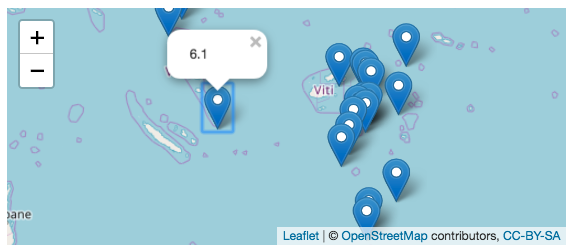
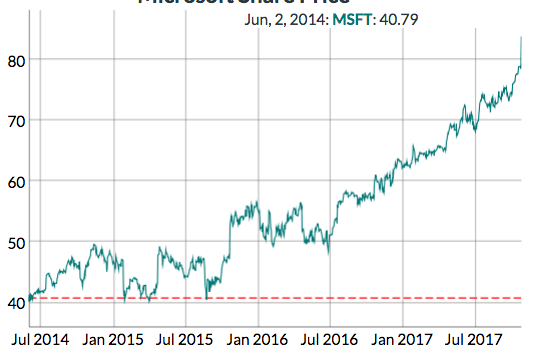

# shiny-ck

Shiny app for [Santa Barbara Channel Keeper Water Quality Monitoring Data](https://www.sbck.org/current-issues/water-quality-monitoring/download-our-data/)

## TODO

- [x] add basic leaflet map
- [x] add basic dygraph timeseries plot
- [ ] use [shinydashboard](http://rstudio.github.io/shinydashboard/)
  - [ ] make tabs of Map & Timeseries
- [ ] expand Parameter drop-down with headings by Excel tab (ie Chemistry, Bacteria, Nutrients)
- [ ] add exceedences (based on CentralCoastStandards, LABasinStandards tabs in xlsx) to dygraph using [dyLimit()](https://rstudio.github.io/dygraphs/gallery-event-lines.html)
- [ ] color [leaflet markers on map](http://rstudio.github.io/leaflet/markers.html) based on number of times in exceedence of threshold in red scale, otherwise green
  - [ ] limit colorized map based on time window of dygraph time series plot and/or include [dateRangeInput]( https://shiny.rstudio.com/gallery/date-and-date-range.html)
- embed / link app at https://www.sbck.org (eg with [iframe](https://community.rstudio.com/t/iframe-shiny-apps-to-wordpress/962))

Current status:

  [https://bdbest.shinyapps.io/sbck/](https://bdbest.shinyapps.io/sbck/) 
  

## Map of Sites

* [Leaflet for R - Introduction](http://rstudio.github.io/leaflet/)

## Time Series of Variables

* [dygraphs for R](https://rstudio.github.io/dygraphs/index.html)
* [ggplot2 Graphing Library | Plotly](https://plot.ly/ggplot2/)

### Horizontal Exceedences

- hi N (better than P), hi P, **lo DO** (fish killer), hi Ph

## Make it Shiny

Start with Rmarkdown output, link map to time series with Shiny.
